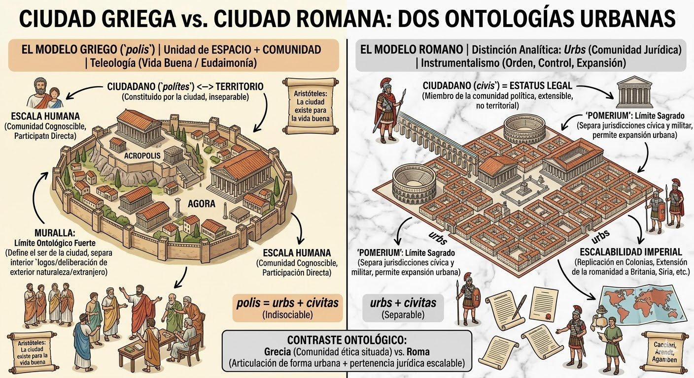
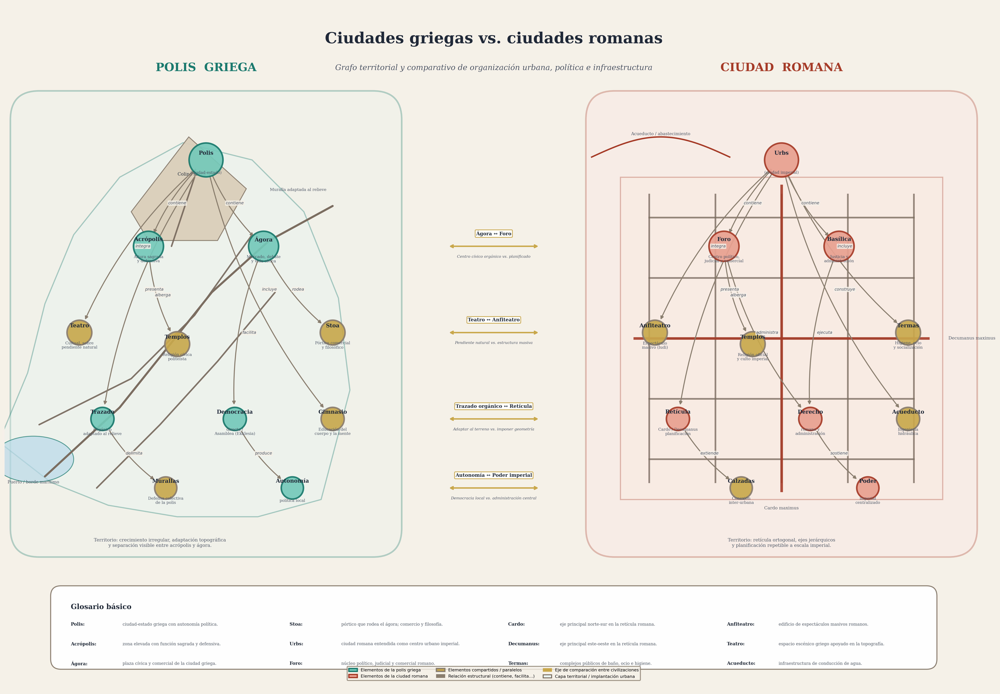
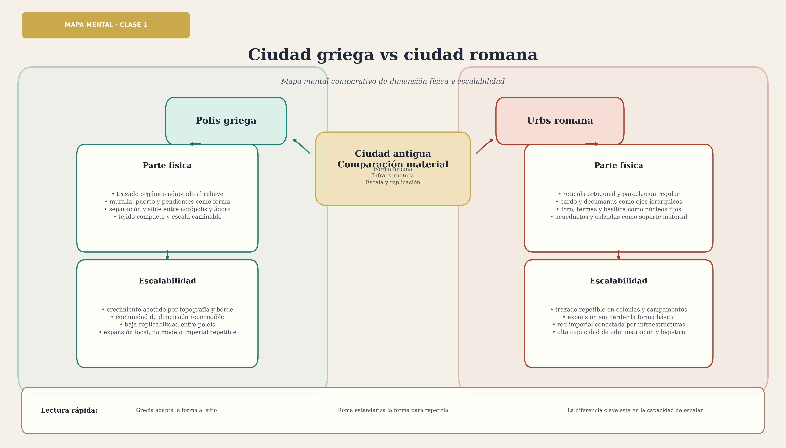

# Ciudad griega vs. ciudad romana: dos ontologías urbanas

Grecia y Roma no se diferencian únicamente por su trazado urbano o por sus instituciones: se distinguen por el modo en que **conciben qué es una ciudad**. El contraste debe leerse como un modelo comparativo ideal-típico —simplifica para mostrar una diferencia estructural— pero sus consecuencias filosóficas son de gran alcance.

El modelo griego concentra en la `polis` la unidad entre espacio, comunidad y finalidad ética. El modelo romano, en cambio, separa analíticamente la ciudad como forma material (`urbs`) de la comunidad política y jurídica (`civitas`), lo que permite una lógica expansiva que el griego no contempla.

---

## 1. El modelo griego: la `polis`

En el caso griego, la `polis` no es simplemente el asentamiento físico ni exclusivamente el cuerpo cívico: es la unidad de ambos.

- No hay ciudad sin ciudadanos.
- No hay ciudadanos sin ciudad.
- Espacio y comunidad aparecen fundidos en un mismo concepto.

La ciudad griega no se entiende como un contenedor neutral de población. La `polis` es una forma de vida compartida que solo puede realizarse en un marco urbano determinado. El ciudadano —`polítes`— no es un individuo previamente dado que luego recibe derechos, sino un ser que se constituye en y por la ciudad. La ciudadanía griega implica participación en la vida pública, pertenencia a una comunidad concreta e inseparabilidad entre identidad política y lugar de la ciudad.

### Forma urbana y espacios cívicos

La `polis` crece **con** el terreno: calles estrechas que siguen curvas de nivel, plazas irregulares, aprovechamiento de la pendiente para el teatro y las defensas. La cuadrícula ortogonal aparece con Hipódamo de Mileto (s. V a.C.) como racionalización política del espacio, pero incluso entonces la retícula griega se adapta al sitio y permanece ligada a la escala de la ciudad-estado (ver [Hipódamo de Mileto](07-hipodamo-de-mileto.md)).

El **ágora** y la **acrópolis** expresan la doble polaridad de la ciudad griega: lo cívico-político en el llano abierto, lo sagrado-representativo en la altura. Ninguna de las dos funciones se confunde con la otra, y su separación espacial es ontológicamente significativa (ver [Acrópolis y ágora de Atenas](06-acropolis-y-agora-de-atenas.md)).

El **teatro**, construido sobre la pendiente natural y vinculado al culto dionisíaco, era un instrumento de formación moral del ciudadano; su escala es coherente con la dimensión de una comunidad cognoscible.

### El límite: la muralla como definición ontológica

La muralla cumple una función ontológica fuerte: no solo protege, sino que **define el ser de la ciudad**. Dentro de ella se encuentra el ámbito del `logos`; fuera aparece lo no integrado al orden cívico —la naturaleza, el extranjero radical, el bárbaro—. La frontera distingue un interior civilizado, discursivo y normado de un exterior no plenamente incorporado a ese orden. La oposición no debe tomarse de manera meramente geográfica.

### Escala y medida

La `polis` es pensada como una comunidad de escala limitada. Aristóteles subraya que no debe crecer hasta el punto de volverse irreconocible para sus propios miembros: los ciudadanos han de poder reconocerse entre sí, la deliberación exige proximidad y la comunidad política requiere una medida humana. La `polis` es, en este sentido, una ciudad **intensiva** más que extensiva.

### Ontología teleológica: la vida buena

La ciudad griega existe para la **vida buena** (*eudaimonía*): ese es su `telos`, el florecimiento humano que solo se alcanza en comunidad política. El ser humano se completa en la `polis`, que no es un simple instrumento sino la condición de posibilidad de la vida ética. Para una discusión extensa de este *telos* y su fundamento aristotélico, ver [Ontología de la ciudad](01-ontologia-de-la-ciudad.md) y [Platón y Aristóteles: origen y fin de lo urbano](02-platon-y-aristoteles-origen-y-fin-de-lo-urbano.md).

---

## 2. El modelo romano: `urbs` + `civitas`

El modelo romano opera con una distinción que el griego no desarrolla del mismo modo: `urbs` nombra la ciudad material, física, construida; `civitas` nombra la comunidad cívica y jurídica. La consecuencia filosófica es decisiva: ambos planos pueden separarse relativamente. Puede haber persistencia de la `urbs` sin la antigua `civitas`, y puede extenderse la `civitas` más allá de un único soporte urbano originario.

### El ciudadano romano: `civis`

El `civis` no aparece ligado de manera inmediata a un territorio urbano único. Su pertenencia a la `civitas` tiene un carácter **jurídico**:

- La ciudadanía es un estatus legal.
- No es, ante todo, una identidad territorial.
- La comunidad puede ampliarse sin depender de una sola ciudad física.

La ciudadanía se vuelve una categoría transferible, graduable y extensible, lo que hace posible formas amplias de integración política.

### Forma urbana y espacios de poder

La ciudad romana **impone** su geometría. El trazado del *castrum* —*cardo maximus* (norte-sur) y *decumanus maximus* (este-oeste)— se replica desde Britania hasta Siria; la regularidad es herramienta de control territorial y logístico, no mera solución estética. El **foro** romano es un recinto más formal que el ágora: escenario de poder donde los templos quedan integrados y el culto imperial funciona como función del Estado. Esta arquitectura de equipamientos —anfiteatro, termas, acueductos, calzadas— expresa la lógica del Imperio (ver [Ciudades romanas: imperio y expansión](04-ciudades-romanas-imperio-y-expansion.md)).

### El `pomerium` y la separación de órdenes

El `pomerium` es un **límite sagrado** que distingue órdenes distintos —especialmente lo civil y lo militar—. Frente a la muralla griega como definición fuerte del adentro y el afuera comunitario, el `pomerium` romano cumple otra función:

- Separa jurisdicciones.
- Organiza el estatuto del espacio.
- Permite que la ciudad cambie de escala sin perder su forma institucional básica.

Esta diferencia es la clave del contraste ontológico: la muralla griega es indivisible de la comunidad que encierra; el `pomerium` romano es técnicamente separable de la `civitas` que puede extenderse sin él.

### Vías, escalabilidad e Imperio

La red viaria romana no es solo articulación interna de la ciudad, sino tecnología de integración territorial: conecta colonias, desplaza ejércitos, transporta tributos y hace posible la repetición del modelo urbano a gran escala. La vía griega, en cambio, sirve ante todo a la escala cívica y local de la `polis` (ver [Vías griegas y romanas](05-vias-griegas-y-romanas.md)). Mientras la `polis` se piensa en una dimensión relativamente acotada, Roma construye una forma urbana y política **escalable**: replica la `urbs` en colonias, exporta instituciones y extiende la `civitas` a territorios distantes.

### Ontología instrumental: orden y control

La ontología romana puede caracterizarse como **instrumental**: la `urbs` aparece como medio técnico de control, orden y extracción, mientras la `civitas` se presenta como contrato o forma legal de pertenencia. La ciudad funciona como dispositivo administrativo; el espacio urbano se vuelve técnica de gobierno; la expansión territorial no destruye la forma urbana, sino que la multiplica. En este modelo, la ciudad se aproxima más a una tecnología de organización del mundo que a la comunidad ético-política intensiva propia de la `polis`.

---

## 3. Cuadro comparativo

| Dimensión | Polis griega | Ciudad romana |
|---|---|---|
| **Concepto central** | `Polis`: unidad de espacio y comunidad | `Urbs` + `civitas`: distinción entre lo físico y lo jurídico-social |
| **Ciudadano** | `Polítes`: inseparable de la ciudad | `Civis`: miembro legal de una comunidad política |
| **Límite** | Muralla como definición del mundo cívico | `Pomerium`: distinción de órdenes y jurisdicciones |
| **Centro cívico** | Ágora: espacio abierto de mercado, asamblea y debate | Foro: recinto político, judicial, comercial y ceremonial |
| **Espacio sagrado** | Acrópolis: altura separada del centro cívico | Templos integrados en el foro; culto imperial como función del Estado |
| **Trazado** | Orgánico, adaptado al relieve y la topografía | Retícula ortogonal (*cardo* / *decumanus*), replicable en cualquier terreno |
| **Espectáculo** | Teatro en ladera: formación moral del ciudadano | Anfiteatro autoportante: control social (*panem et circenses*) |
| **Infraestructura** | Obras a escala de la polis | Ingeniería monumental: acueductos, calzadas, termas, cloacas |
| **Escala** | Medida limitada, comunidad cognoscible | Escalabilidad imperial y reproducción colonial |
| **Ontología** | Teleológica: la ciudad existe para la vida buena | Instrumental: la ciudad opera como técnica de orden y control |
| **Principio político** | Participación directa (*ekklesia*); identidad cívica local | Derecho codificado; administración provincial centralizada |

---

## 4. Dimensiones del curso

### Ontología de la ciudad

Grecia piensa la ciudad como comunidad ética y política orientada a un fin (*telos*); Roma la articula como combinación entre soporte material (`urbs`) y forma jurídica extensible (`civitas`). La pregunta por el **ser** de la ciudad recibe respuestas radicalmente distintas en cada tradición.

### Poder

La diferencia entre muralla y `pomerium`, así como entre `polis` y `urbs`, muestra dos tecnologías distintas de poder: una centrada en la comunidad delimitada; otra en la administración, la expansión y la organización legal del territorio. Ambas son ciudades políticas, pero la primera pregunta por *quién participa* y la segunda por *quién gobierna*.

### Política

En Grecia, la política está intrínsecamente ligada a la participación en una comunidad situada. En Roma, la política se juridifica y se vuelve más compatible con la escala imperial.

---

## 5. Glosario de términos clave

Los términos centrales de esta nota se recogen en el glosario unificado del curso. A continuación se ofrece una referencia rápida fiel a las fuentes:

| Término | Referencia rápida |
|---|---|
| **Polis** | Ciudad-estado griega; unidad indisoluble de espacio físico y comunidad política. |
| **Polítes** | Ciudadano griego; su identidad política es inseparable de la `polis` que habita. |
| **Urbs** | La ciudad romana como forma urbana material, organizada dentro de una lógica jurídica, administrativa e imperial. |
| **Civitas** | La comunidad cívica y jurídica romana; puede extenderse más allá de un único soporte urbano. |
| **Civis** | Ciudadano romano; su pertenencia a la comunidad es un estatus legal, no ante todo territorial. |
| **Ágora** | Plaza principal de la `polis`; espacio de mercado, encuentro y discusión cívica, delimitado por *stoas*. |
| **Acrópolis** | Zona alta y fortificada de la ciudad griega, con templos y funciones sagradas y defensivas. |
| **Foro** | Centro político, judicial, comercial y ceremonial de la ciudad romana. |
| **Pomerium** | Límite sagrado de la ciudad romana que distingue órdenes (civil/militar) y organiza el estatuto del espacio. |
| **Telos** | Fin o propósito intrínseco; en Aristóteles, el `telos` de la ciudad es la *eudaimonía* (vida buena). |
| **Eudaimonía** | Florecimiento o vida buena; fin último de la `polis` griega según Aristóteles. |
| **Cardo maximus** | Eje principal norte-sur del trazado urbano romano. |
| **Decumanus maximus** | Eje principal este-oeste del trazado urbano romano. |
| **Stoa** | Pórtico cubierto que delimita el ágora; espacio para el comercio, la circulación y la actividad intelectual. |

---

## 6. Fórmula de síntesis

> **Grecia piensa la ciudad como comunidad ética situada.**
>
> **Roma piensa la ciudad como articulación entre forma urbana y pertenencia jurídica escalable.**

---

## 7. Fuentes

- Cacciari, M. (2004). *La ciudad*.
- Agamben, G. (1995). *Homo Sacer*.
- Arendt, H. (1958). *La condición humana*.
- Mumford, L. (1961). *The City in History*.
- Morris, A. E. J. (1994). *History of Urban Form*.
- Castagnoli, F. (1971). *Orthogonal Town Planning in Antiquity*.
- Hansen, M. H. (2006). *Polis: An Introduction to the Ancient Greek City-State*.
- Zanker, P. (2000). *The Power of Images in the Age of Augustus*.

---

## Ver también

- [Ciudades romanas: imperio y expansión](04-ciudades-romanas-imperio-y-expansion.md)
- [Vías griegas y romanas](05-vias-griegas-y-romanas.md)
- [Acrópolis y ágora de Atenas](06-acropolis-y-agora-de-atenas.md)
- [Hipódamo de Mileto](07-hipodamo-de-mileto.md)
- [Glosario](../../../glosario.md)
