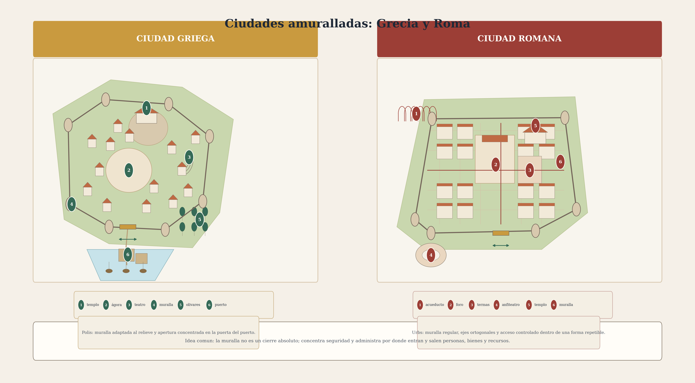

# La ciudad amurallada: membrana y permeabilidad

## Idea central

La ciudad amurallada no es únicamente un recinto defensivo: funciona como una **membrana urbana**. La muralla no equivale a un muro inmóvil; es un borde que **separa, filtra y regula** la relación entre un interior protegido y un exterior potencialmente amenazante o no integrado.

La metáfora de la membrana es útil porque evita dos simplificaciones simétricas:

- entender la ciudad amurallada como cierre absoluto;
- o entenderla como espacio completamente abierto al exterior.

En la práctica, la ciudad histórica opera mediante una combinación de **cierre perimetral**, **puntos de apertura controlada** y **administración diferencial de flujos**.

## 1. Muralla y protección de lo acumulado

La muralla puede ponerse en relación con la necesidad de proteger bienes, parcelas, talleres, reservas, familias e instituciones. La ciudad no se cierra de manera arbitraria: se cierra porque en su interior se concentra algo que debe ser preservado.

La muralla protege simultáneamente:

- vidas;
- bienes;
- espacios apropiados;
- infraestructuras;
- formas de organización social.

Por eso, la ciudad amurallada no es solo una figura militar. Es también una **tecnología de resguardo** de lo que ha sido acumulado, apropiado y organizado —en común o en privado.

## 2. La ciudad como membrana selectiva

Decir que la ciudad es una membrana significa que su borde no es completamente opaco. La muralla:

- se abre para dejar entrar mercancías, agua, personas e información;
- se abre para dejar salir comercio, excedentes, viajeros y ejércitos;
- se cierra cuando el exterior aparece como amenaza;
- y en ese gesto distingue entre flujo permitido y flujo bloqueado.

La **puerta** es el elemento decisivo de esta lógica. Si la muralla representa el cierre, la puerta representa la **permeabilidad regulada**: no anula la separación entre dentro y fuera, pero la administra.

## 3. Interior y exterior

La ciudad amurallada produce una fuerte diferencia espacial y política entre:

- el **adentro**: espacio protegido, habitable y normado;
- el **afuera**: espacio no asegurado, campo, frontera o amenaza.

La muralla organiza así una experiencia elemental de seguridad:

- dentro hay refugio relativo;
- fuera hay exposición mayor;
- entre ambos media un borde construido.

En ese sentido, la ciudad puede entenderse como una forma colectiva de **reducir vulnerabilidad**.

## 4. Seguridad en distintas escalas

La protección que ofrece la ciudad amurallada opera en varios niveles simultáneos.

### Escala doméstica
La vivienda protege cuerpos, familia, objetos y descanso.

### Escala barrial o de proximidad
La agrupación de casas, calles y vecinos genera vigilancia mutua, apoyo y circulación conocida.

### Escala urbana
La muralla protege el conjunto: bienes, mercado, instituciones, reservas y población.

La ciudad amurallada no reemplaza las otras escalas sino que las engloba. La seguridad urbana es una **superposición de envolventes protectoras**.

## 5. Apertura y cierre: el carácter dinámico del borde

La noción de membrana capta el carácter dinámico del borde urbano. No se trata solo de una línea en el espacio, sino de una operación:

- en condiciones ordinarias, la ciudad necesita intercambiar;
- en condiciones de riesgo, necesita cerrarse;
- por eso su límite debe ser a la vez **firme** y **operable**.

La muralla histórica no elimina la movilidad; la canaliza. Obliga a que el paso ocurra por ciertos puntos, bajo ciertas reglas, en ciertos tiempos.

## 6. Lectura conceptual del plano amurallado

El plano de ciudad amurallada refuerza varias ideas a la vez:

- el perímetro es claramente reconocible;
- el interior aparece densamente ocupado;
- las entradas están localizadas en puntos concretos;
- el borde dibuja una diferencia tajante entre ciudad y exterior.

El plano permite leer la ciudad como un **cuerpo con piel propia**: no es una simple aglomeración de edificios, sino una figura territorial delimitada.

## 7. Dimensiones conceptuales del curso

### Ontología de la ciudad
La ciudad aparece aquí como una realidad delimitada por un borde operativo. Su ser no depende solo de sus edificios, sino también de la forma en que separa y articula interior y exterior.

### Poder
Controlar puertas, accesos y cierres significa controlar circulación, defensa, fiscalidad y seguridad. La muralla es una **tecnología de poder territorial**.

### Política
La necesidad de protección ayuda a explicar por qué los individuos aceptan concentrarse y vivir bajo un orden común. La ciudad ofrece una seguridad que no se obtiene del mismo modo en el aislamiento.

---

> **La ciudad amurallada no es solo un recinto: es una membrana selectiva.**
> **Se abre para dejar circular flujos y se cierra para producir seguridad.**
