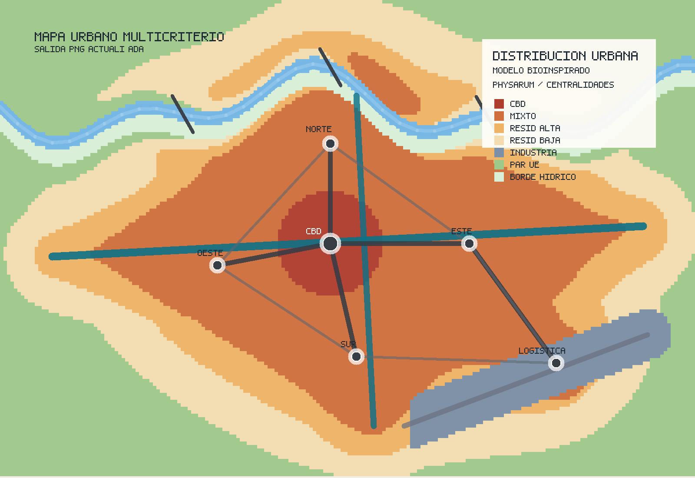

# Un algoritmo simple para la distribución urbana (modelo Physarum)

## Idea central

Este material defiende una tesis concreta: para una tarea acotada de planificación urbana, un algoritmo simple, explicable y reproducible puede rendir mejor que una IA generalista.

Aquí "mejor" no significa producir la ciudad perfecta. Significa algo más preciso para ingeniería y planificación:

- usa reglas claras
- produce siempre una salida verificable
- permite auditar cada decisión
- cuesta muy poco computacionalmente
- se puede ajustar con criterios urbanos concretos

## Base teórica: el modelo Physarum

El algoritmo se inspira en *Physarum polycephalum*, un moho mucilaginoso —no un hongo estricto— ampliamente estudiado como modelo biológico de crecimiento eficiente en red. Este organismo tiende a formar redes de conexión muy eficientes entre puntos de alimento, y ha servido de inspiración para investigaciones sobre:

- redes de transporte
- conexiones optimizadas
- reducción de costo de infraestructura
- equilibrio entre cobertura y longitud total de red

Trasladada al urbanismo, la lógica del modelo opera así:

- los centros urbanos atraen densidad
- las conexiones entre nodos deben ser cortas y robustas
- un corredor fuerte de transporte ordena el crecimiento
- el borde ecológico limita la expansión ciega

## Qué hace el algoritmo

El script `utils/generar_distribucion_urbana.py` construye una imagen urbana mediante las siguientes reglas:

1. Define un centro principal y varios subcentros.
2. Calcula la atracción espacial de cada punto del mapa hacia esos nodos.
3. Agrega un eje fuerte de transporte y un eje logístico.
4. Introduce un corredor de agua y áreas verdes como restricción ecológica.
5. Clasifica cada celda del territorio en una de cinco categorías: `core`, `mixed`, `residential`, `productive` o `green`.
6. Conecta los nodos con una red mínima mediante un árbol de expansión mínima.
7. Agrega enlaces secundarios para robustez territorial.

## Variables urbanas incorporadas

- atracción por centro principal
- atracción por subcentros
- proximidad al eje de transporte
- proximidad al eje logístico
- penalización por cercanía al corredor de agua
- penalización ligera por borde
- ruido pequeño para evitar rigidez total

## Lectura de la imagen

| Color | Categoría |
|---|---|
| Rojo | centro de alta densidad |
| Naranja | uso mixto |
| Amarillo | residencial |
| Azul gris | productivo y logístico |
| Verde | corredor ecológico o baja ocupación |
| Línea oscura | red vial mínima |
| Línea azul | eje principal de transporte |

## Por qué este enfoque puede superar a una IA generalista

En una tarea como "distribuir nodos urbanos y conectarlos con baja longitud total y buena cobertura", una IA generalista presenta tres problemas recurrentes:

- no garantiza consistencia entre ejecuciones
- puede producir propuestas visualmente convincentes pero poco auditables
- mezcla intuición textual con criterios técnicos no explicitados

En cambio, un algoritmo simple como este ofrece ventajas directas: cada parámetro tiene significado urbano, cada cambio puede medirse, la solución es replicable, el costo computacional es bajo y se integra fácilmente con datos reales.

La afirmación que se defiende no es que los algoritmos simples vencen siempre a la mejor IA. La formulación correcta es esta:

> En tareas urbanas bien definidas, con objetivos geométricos y restricciones explícitas, un algoritmo simple puede superar a una IA generalista en transparencia, estabilidad, trazabilidad y control operativo.

## Especificaciones técnicas

- Lenguaje: Python 3
- Librerías externas: ninguna
- Semilla fija: `23`
- Salida principal: `clases/clase-01-fundamentos/recursos/distribucion-urbana/distribucion_urbana_physarum.png`
- Salida auxiliar (datos): `clases/clase-01-fundamentos/recursos/distribucion-urbana/distribucion_urbana_physarum.json`

## Valor filosófico y metodológico

Este ejercicio abre una discusión sobre técnica y ciudad:

- la técnica no necesita ser opaca para ser poderosa
- un sistema simple puede contener más racionalidad práctica que una caja negra
- en planificación, explicar por qué se decide algo puede ser más importante que impresionar visualmente

## Límites honestos del modelo

Este algoritmo es una demostración, no un plan regulador real. No incorpora:

- topografía real
- costo del suelo
- datos demográficos observados
- riesgo hidrológico detallado
- normativa urbana
- tiempos reales de viaje

## Conclusión

La lección metodológica central es la siguiente: cuando el problema está bien definido, un algoritmo pequeño y claro puede ser más útil que una IA poderosa pero genérica. Para estructurar redes, ordenar centralidades y producir una primera distribución territorial coherente, este tipo de algoritmo resulta extremadamente eficiente.
